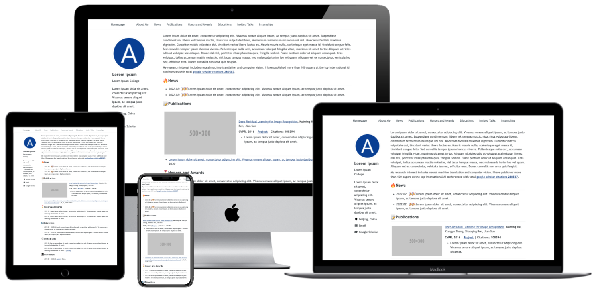

<h1 align="center">
Yingjiao Zhou's Personal Homepage
</h1>

<p align="center">
    <br>
    
    <br>
</p>

## About This Website

This is the personal academic homepage of Yingjiao Zhou, an undergraduate student majoring in Software Engineering at Harbin Engineering University. The website showcases his research interests, projects, honors, and educational background.

## Research Interests
- Diffusion probabilistic models (DDPM, DDIM)
- Computational imaging and inverse problems
- Generative modeling
- Data augmentation and robustness

## Key Features of This Website
- **Responsive Design**: Automatically adjusts for different screen sizes and viewports
- **Beautiful and Simple Layout**: Clean and professional design suitable for academic personal homepage
- **SEO Optimized**: Helps search engines find the information easily
- **Easy to Update**: Uses Jekyll for static site generation

## How to Access
The website is published at [https://jiao-z702.github.io](https://jiao-z702.github.io)

## Local Development

1. Clone this repository to your local machine:
   ```bash
   git clone https://github.com/jiao-z702/jiao-z702.github.io.git
   ```

2. Install Jekyll building environment, including `Ruby`, `RubyGems`, `GCC` and `Make` following [the installation guide](https://jekyllrb.com/docs/installation/#requirements).

3. Run the local development server:
   ```bash
   bash run_server.sh
   ```

4. Open [http://127.0.0.1:4000](http://127.0.0.1:4000) in your browser to view the website.

5. When you finish modifying the website, commit your changes and push to the remote repository:
   ```bash
   git add .
   git commit -m "Update website content"
   git push -u origin main
   ```

## Acknowledgements

- This website is built using the [AcadHomepage](https://github.com/RayeRen/acad-homepage.github.io) template, which is distributed under the MIT License.
- AcadHomepage incorporates Font Awesome, which is distributed under the terms of the SIL OFL 1.1 and MIT License.
- AcadHomepage is influenced by the github repo [mmistakes/minimal-mistakes](https://github.com/mmistakes/minimal-mistakes), which is distributed under the MIT License.
- AcadHomepage is influenced by the github repo [academicpages/academicpages.github.io](https://github.com/academicpages/academicpages.github.io), which is distributed under the MIT License.
